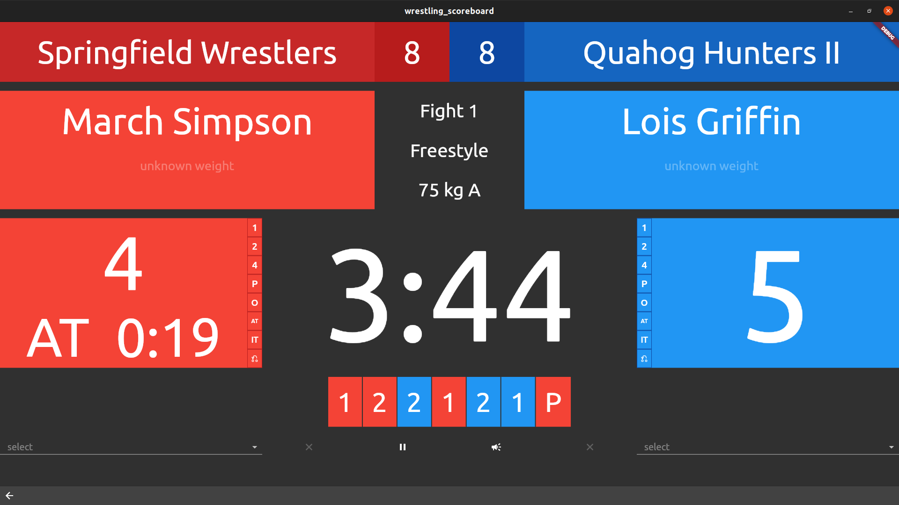
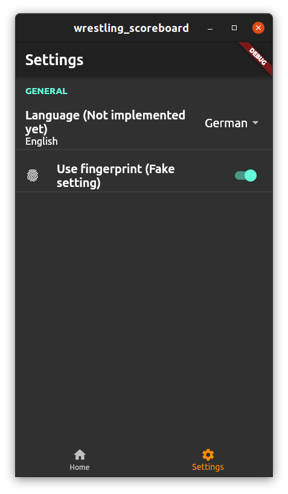
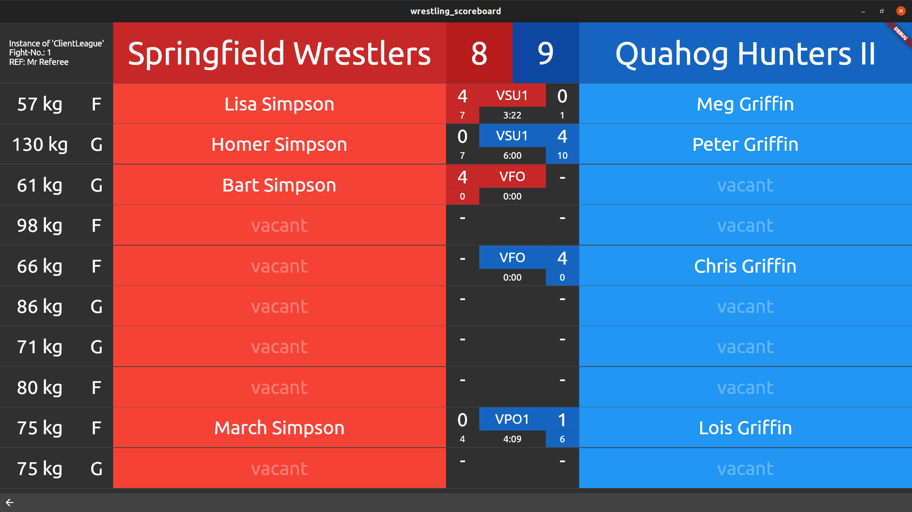
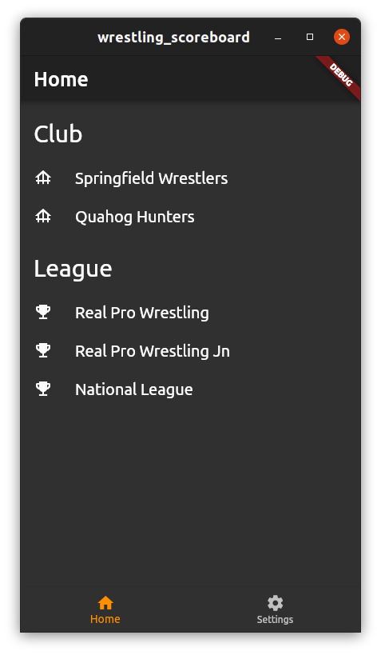

# Wrestling Scoreboard

Repository for managing Wrestling software client, server and shared libraries.

Tags: scoreboard, wrestling, scoring, bracket, mat, team fight, competition, tournament

## Screenshots

<table>
  <tr>
    <td width="73%"></td>
    <td></td>
  </tr>
  <tr>
    <td width="73%"></td>
    <td></td>
  </tr>
</table>

## Setup & Installation

Please read the documentation for setting up the according components:
- [Server](wrestling_scoreboard_server/README.md)
- [Database](wrestling_scoreboard_server/database/README.md)
- [Client](wrestling_scoreboard_client/README.md)

If using [Nginx](https://en.wikipedia.org/wiki/Nginx) as Reverse Proxy, you can take advantage of [these config](docs/nginx) files.

## License

Published under [MIT license](./LICENSE.md).
