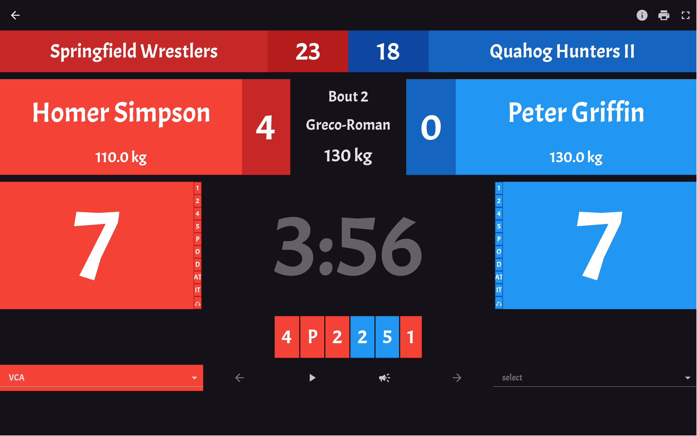
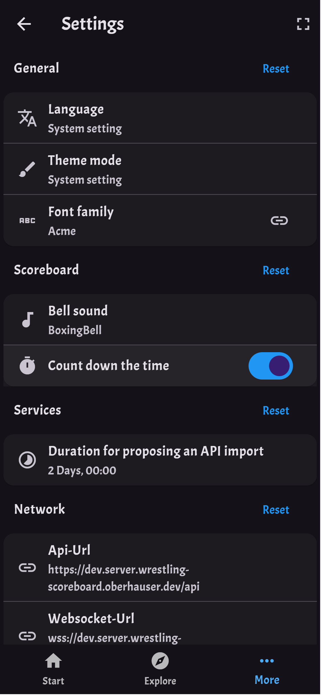
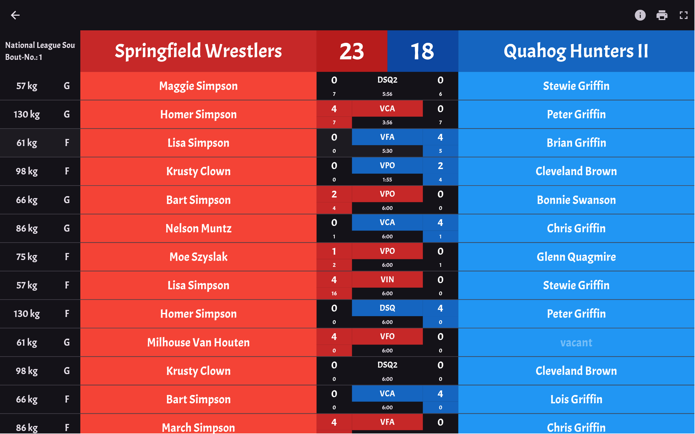
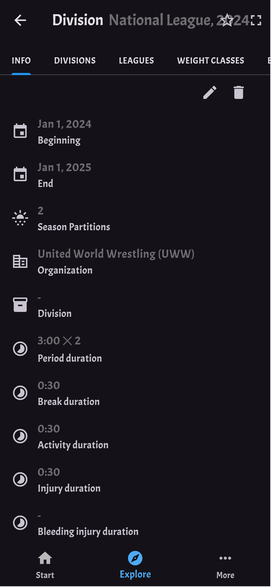
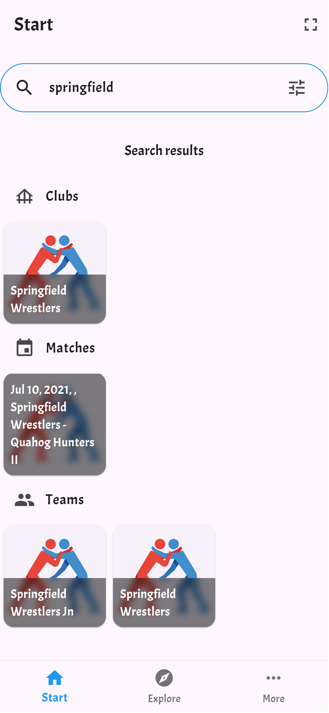
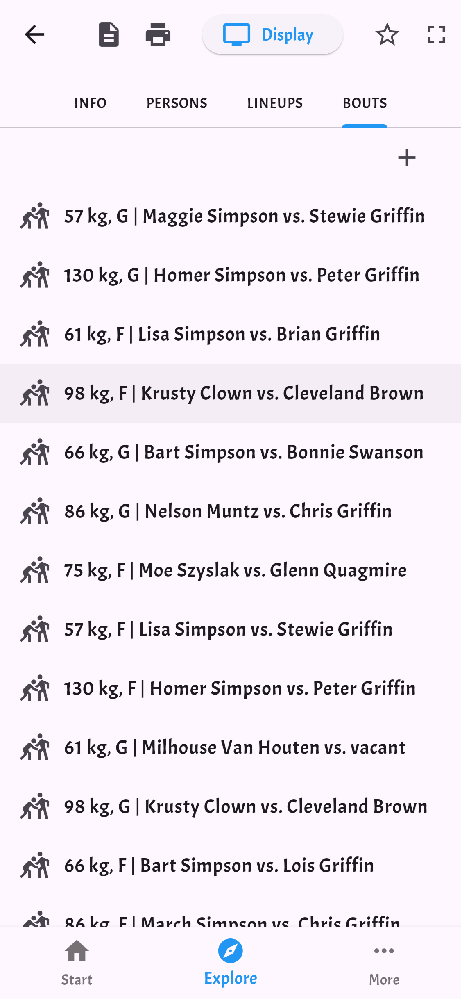
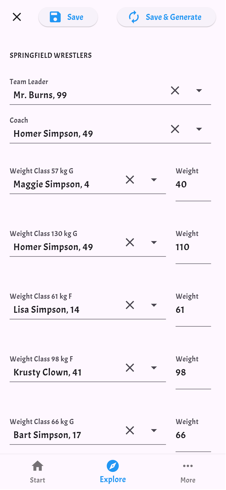
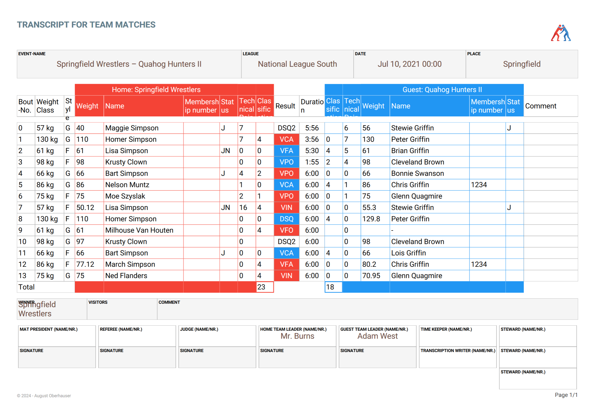
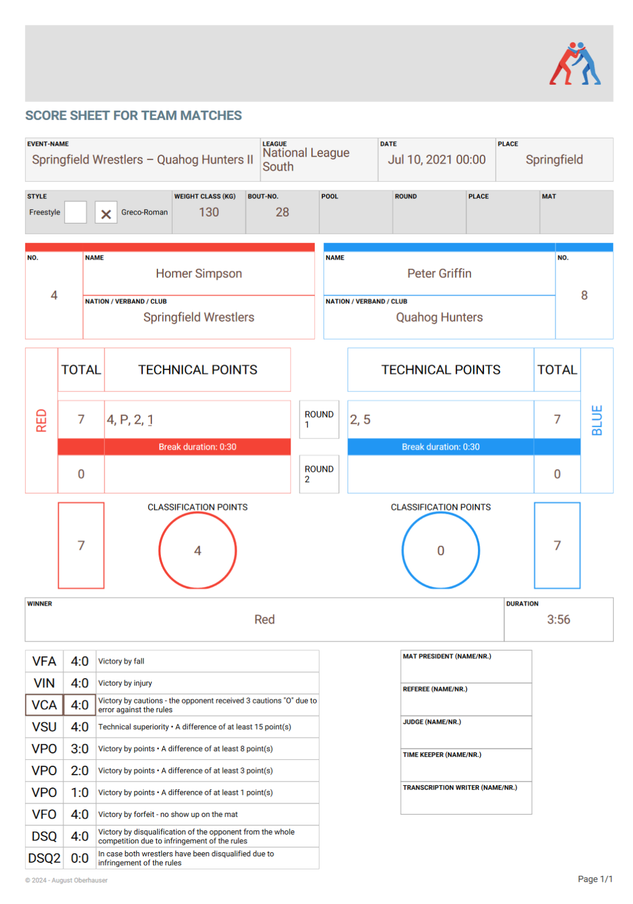

# Wrestling Scoreboard

Repository for managing Wrestling software: client, server and shared libraries.
Available for Linux, Windows, macOS, Web, Android and iOS.

Tags: scoreboard, wrestling, scoring, bout, mat, team, fight, competition, tournament, display, points, bracket, team, athlete, elimination

> **NOTE:** This project is still experimental.
> Use with care.
> 
> This might include unfinished features, bugs, or incompatibilities with older versions.

## Screenshots

<table>
  <tr>
    <td colspan="2"></td>
    <td></td>
  </tr>
  <tr>
    <td colspan="2"></td>
    <td></td>
  </tr>
  <tr>
    <td width="33.3%"></td>
    <td width="33.3%"></td>
    <td></td>
  </tr>
  <tr>
    <td colspan="2"></td>
    <td></td>
  </tr>
</table>

## Installation

The App consists of three components, the client, the server and the database.
You can download the client and the server for your preferred platforms from the [Releases section](https://github.com/Oberhauser-Dev/wrestling_scoreboard/releases).

For setting up the database and hosting a server, see the [Server Setup](wrestling_scoreboard_server/README.md#setup).

## Instructions

The program aligns with the [UWW Wrestling Rules](./wrestling_scoreboard_client/docs/wrestling_rules/uww-wrestling-rules-en-2023.pdf).
Nonetheless, there are specifics to some regions.

### Germany

#### Freestyle

Germany handles the first a verbal admonition `V` (official) before an activity period as passivity `P` (regional).
Germany handles the passivity `P` (official) which leads to an activity period as `A` (regional).
This means to effectively write a `P`/`A` (regional) one must record `V`/`P` (official) in the application.
On the export, it is then converted to the regional convention.

## Development

All the code is based on Dart and Flutter. For setting up Flutter, see the [getting started guide](https://docs.flutter.dev/get-started).

Wrestling Scoreboard is a monorepo.
Therefor it uses [Melos](https://github.com/invertase/melos) to manage the project and dependencies.
All the commands can be found in the [melos.yaml](melos.yaml) file.

To install Melos, run the following command from your terminal:

```bash
flutter pub global activate melos
```

Next, at the root of your locally cloned repository bootstrap the projects dependencies:

```bash
melos bs
```

To format your code, call:
```bash
melos format
```

To create a new version of all packages, call:
```bash
melos version --all --prerelease --preid=beta --diff=v0.0.1-beta.11
```

Pin to a specific version:
```bash
 melos version -a --no-git-tag-version -V wrestling_scoreboard_client:0.3.5 -V wrestling_scoreboard_common:0.3.5 -V wrestling_scoreboard_server:0.3.5
```

Please read the documentation for setting up the according components:
- [Database](wrestling_scoreboard_server/database/README.md)
- [Server](wrestling_scoreboard_server/README.md#development)
- [Client](wrestling_scoreboard_client/README.md)

## License

Published under [MIT license](./LICENSE.md).
